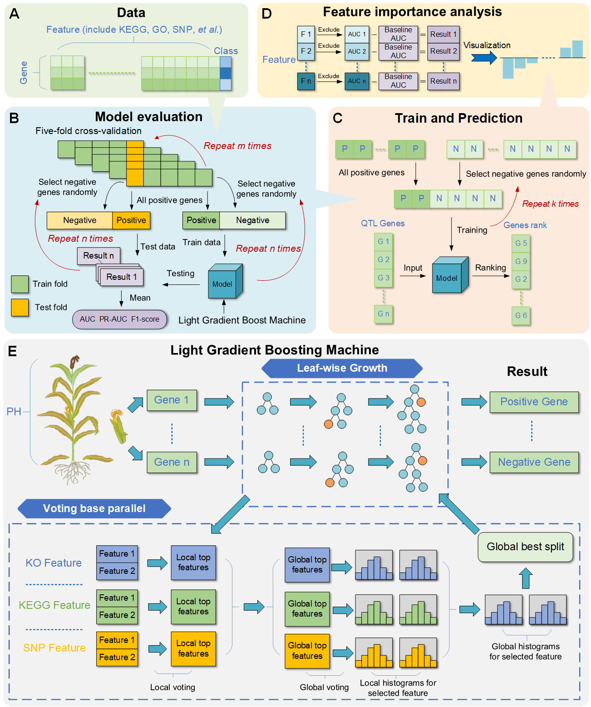

# QTG-LGBM: A Method employed for Prioritizing QTL Causal Gene in Maize

## QTG-LGBM
**QTG-LGBM** is a LightGBM-based approach for mining causal genes associated with quantitative trait loci in maize. LightGBM includes *voting parallel*, *Leaf-wise growth* and *Histogram algorithm* to reduce training time and memory consumption.

For additional details, we kindly invite you to refer to the QTG-LGBM publication:  [*<ins>QTG-LGBM: A Method employed for Prioritizing QTL Causal Gene in Maize</ins>*]

We also offer you the **online service version** of QTG-LGBM. Please visit [*http://www.deepcba.com*](http://www.deepcba.com) for more information.

### QTG-LGBM Introduction
We built a method called **QTG-LGBM** to predict *candidate causal genes* base on *maize quantitative trait loci(QTL)*.

*QTG-LGBM* includes three sequential steps.

Fist setp, we
